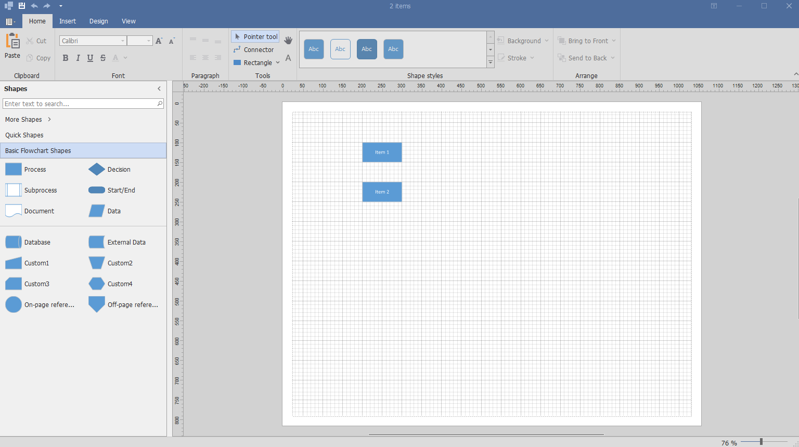
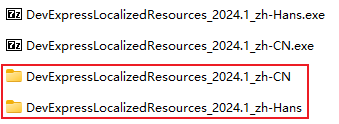
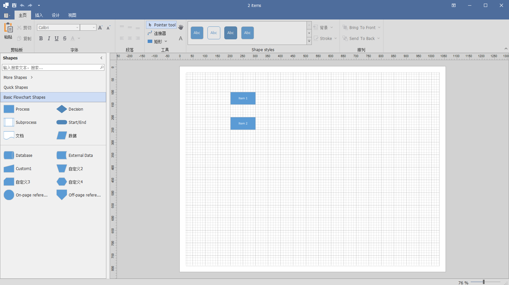
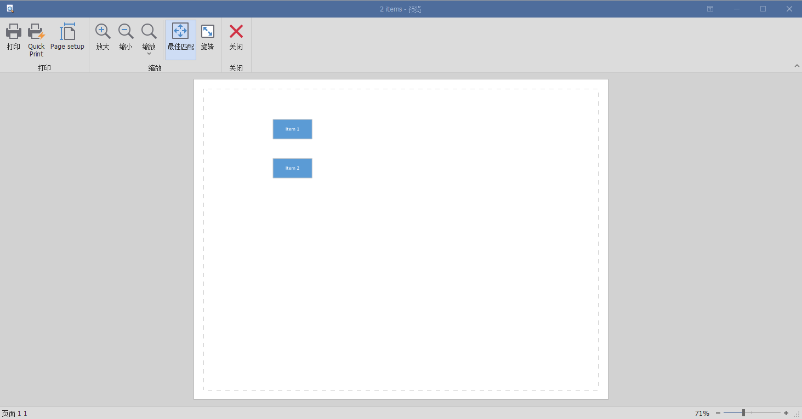
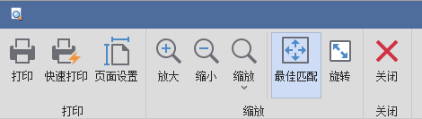
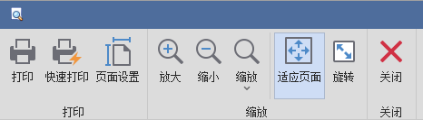

# DevExpress WinForms汉化

说明

* 使用控件：DevExpress V24.1.3

## 运行项目

运行项目，界面语言是英文

​​

## 使用汉化文件汉化

下载“DevExpressLocalizedResources_2024.1_zh-CN.zip”和“DevExpressLocalizedResources_2024.1_zh-Hans.zip”并解压

​​

修改“DevExpressLocalizedResources_2024.1_zh-CN”文件夹名为“zh-CN”，修改“DevExpressLocalizedResources_2024.1_zh-Hans”文件名为“zh-Hans”

复制文件夹“zh-CN”和“zh-Hans”到程序生成目录，即Debug文件夹或Release文件夹

在Program.cs的Main函数新增两行代码

```cs
static void Main()
{
    System.Threading.Thread.CurrentThread.CurrentUICulture = new System.Globalization.CultureInfo("zh-CN");
    System.Threading.Thread.CurrentThread.CurrentUICulture = new System.Globalization.CultureInfo("zh-Hans");
    ...
}
```

再次生成并启动项目，可以看到大部分控件已经汉化完成

​​

但是，仍然有部分控件未汉化，比如下面的打印预览页面，有两处未汉化，接下来介绍如何手动编写代码的方式解决未汉化部分

​​

## 手动汉化——基于事件的本地化

这里使用基于事件的本地化。创建函数“DiagramControlLocalizer_QueryLocalizedString”

```cs
static void Main()
{
    System.Threading.Thread.CurrentThread.CurrentUICulture = new System.Globalization.CultureInfo("zh-CN");
    System.Threading.Thread.CurrentThread.CurrentUICulture = new System.Globalization.CultureInfo("zh-Hans");

    DiagramControlLocalizer.QueryLocalizedString += DiagramControlLocalizer_QueryLocalizedString;

    ...
}

private static void DiagramControlLocalizer_QueryLocalizedString(object sender, XtraLocalizer.QueryLocalizedStringEventArgs e)
{
    if (e.StringIDType == typeof(DiagramControlStringId))
    {
        if ((DiagramControlStringId)e.StringID == DiagramControlStringId.DiagramCommand_QuickPrint)
            e.Value = "快速打印";
        if ((DiagramControlStringId)e.StringID == DiagramControlStringId.DiagramCommand_SetPageParameters_PageSize_Header)
            e.Value = "页面设置";
    }       
}
```

​​

这时，之前通过汉化文件未汉化的两处已经实现了汉化。此外，如果我们对汉化包的汉化“不满意”，需要覆盖其汉化的内容，比如将“最佳匹配”替换为“适应页面”

```cs
        private static void DiagramControlLocalizer_QueryLocalizedString(object sender, XtraLocalizer.QueryLocalizedStringEventArgs e)
        {
            if (e.StringIDType == typeof(DiagramControlStringId))
            {
                if ((DiagramControlStringId)e.StringID == DiagramControlStringId.PrintPreview_BestFit)
                    e.Value = "适应页面";
                ...
            }       
        }
```

最终的汉化结果为：

​​

## 参考

* [DevExpress：手把手教你用官方汉化资源做汉化_devexpress 汉化-CSDN博客](https://blog.csdn.net/weixin_45132755/article/details/132039135)
* [Localizing WinForms Controls with Localizer Objects | WinForms Controls | DevExpress Documentation](https://docs.devexpress.com/WindowsForms/1866/build-an-application/localization/localizing-winforms-controls-via-localizer-objects)

‍

‍

‍

‍
